# NE-ROUTE Architecture & Technical Design

**Problem Statement ID:** 26002  
**Title:** AI-Based Smart Logistics and Accessibility Intelligence Platform for North Eastern Region (NER)  
**Organization:** Ministry of Development of North Eastern Region (MDoNER)  
**Tagline:** *See the road before you send the vehicle.*

---

## 1. System Overview & Mission

NE-ROUTE is an operational logistics command platform and accessibility intelligence system engineered specifically for the terrain and climate challenges of India's 8 North Eastern states (Assam, Meghalaya, Manipur, Mizoram, Nagaland, Tripura, Arunachal Pradesh, and Sikkim).

```
+-----------------------------------------------------------------------+
|                       THE NE-ROUTE INTELLIGENCE LOOP                  |
|                                                                       |
|  [1. SENSE]                                                           |
|  GPS Telemetry + IMD Weather + Field Reports + Road Sensors           |
|        |                                                              |
|        v                                                              |
|  [2. UNDERSTAND]                                                      |
|  Accessibility Engine + Corridor Health (0-100) + District Risks      |
|        |                                                              |
|        v                                                              |
|  [3. PREDICT]                                                         |
|  Disruption Risk ML (Gradient Boosting) + Probability Scoring          |
|        |                                                              |
|        v                                                              |
|  [4. DECIDE]                                                          |
|  Multi-Criteria Graph Solver (Fastest, Lowest-Risk, Bypass)           |
|        |                                                              |
|        v                                                              |
|  [5. ACT]                                                             |
|  Dynamic Rerouting + ETA Calibration + 4-Part Actionable Alerts        |
|        |                                                              |
|        v                                                              |
|  [6. VERIFY & AUDIT]                                                  |
|  WebSocket Broadcast + Outbox Sync + Immutable Audit Trail            |
+-----------------------------------------------------------------------+
```

---

## 2. Multi-Tier Distributed Architecture

```mermaid
graph TB
    subgraph "Clients"
        WEB["Next.js 14 Web Command Center<br/>(TailwindCSS / Leaflet GIS / Lucide)"]
        MOBILE["Offline Field PWA<br/>(Service Worker / IndexedDB / GPS Lock)"]
    end

    subgraph "Edge & Gateway Layer"
        FASTAPI["FastAPI High-Performance Engine (Python 3.11)"]
        WS_HUB["WebSocket Broadcast Gateway (/ws/{channel})"]
        AUTH["RBAC & JWT Security Guard"]
    end

    subgraph "Intelligence & Computation Services"
        ML["ML Disruption Predictor<br/>(GradientBoostingClassifier)"]
        GEO["Spatial GIS & BBOX Telemetry Engine"]
        ROUTING["Multi-Criteria Graph Solver<br/>(Dijkstra / Network Optimization)"]
        ETA["Physics-Aware ETA Engine<br/>(Gradient & Weather Calibration)"]
        ALERTS["Strategic 4-Part Alert Rule Engine"]
        DYNAMIC["Dynamic Closed-Loop Rerouting Engine"]
        SYNC_MGR["Idempotent Outbox Sync Manager"]
    end

    subgraph "Storage & Observability"
        SQL["SQLAlchemy Async ORM<br/>(SQLite / PostGIS 16)"]
        REDIS["Redis 7 Pub/Sub & Telemetry Cache"]
        UPLOADS["Encrypted Incident Media Storage"]
        AUDIT["Immutable Audit Trail & Subsystem Health Matrix"]
    end

    WEB --> FASTAPI
    WEB --> WS_HUB
    MOBILE --> FASTAPI
    FASTAPI --> AUTH
    FASTAPI --> ML
    FASTAPI --> GEO
    FASTAPI --> ROUTING
    FASTAPI --> ETA
    FASTAPI --> ALERTS
    FASTAPI --> DYNAMIC
    FASTAPI --> SYNC_MGR
    FASTAPI --> SQL
    WS_HUB --> REDIS
    FASTAPI --> UPLOADS
    FASTAPI --> AUDIT
```



---

## 3. Core Subsystems

### 3.1 Offline Field PWA & Store-and-Forward Sync
- **Service Worker (`/sw.js`)**: Caches critical application shells, styles, and vector assets.
- **IndexedDB (`incident_outbox`)**: Local durable persistence of reports, GPS coordinates, timestamps, and base64 photos during network blackouts.
- **Connection Awareness**: Four distinct global states (`ONLINE`, `DEGRADED`, `OFFLINE`, `SYNCING`) with millisecond latency pinging.
- **Idempotency Guarantee**: Client-generated UUID keys prevent duplicate submissions during network retries.

### 3.2 Machine Learning Disruption Predictor (`ml.predictor`)
- Pre-trained Gradient Boosting Classifier trained on historical North Eastern monsoon and landslide datasets.
- Computes `disruption_probability` (0.0 to 1.0) and discrete hazard classifications (`LOW`, `ELEVATED`, `HIGH`, `CRITICAL`).
- Provides feature-importance operational explanations (*"Why is this corridor at risk?"*).

### 3.3 Multi-Criteria Graph Routing Engine (`src.services.graph_routing_engine`)
- Models the NER highway network as a directed topological graph with node elevations and terrain hazard weights.
- Generates 4 distinct candidate paths:
  1. **Recommended**: Balances transit time and risk penalty.
  2. **Fastest**: Minimal travel duration.
  3. **Lowest-Risk**: Circumvents active rainfall and landslide sectors.
  4. **Alternative Bypass**: Secondary state highway detours.

### 3.4 ETA Calibration Engine (`src.services.eta_engine`)
- Applies physical terrain multipliers:
  - Surface condition degradation (waterlogged: 0.45x, muddy: 0.65x)
  - Rainfall intensity (monsoon cloudburst: 0.60x)
  - Mountain pass gradient (elevation gain > 800m)
  - Active bottleneck queue delays (+45 mins per clearance sector).

### 3.5 4-Part Actionable Alert Framework (`src.services.alert_rule_engine`)
Every generated alert answers 4 operational questions:
1. **WHAT HAPPENED**: Exact hazard type, location, and road blockage extent.
2. **WHY IT MATTERS**: Threat to cargo integrity, supply lifeline, or convoy safety.
3. **WHO IS AFFECTED**: Target vehicle registrations and receiving destinations.
4. **RECOMMENDED ACTION**: Immediate reroute, staging at toll plaza, or clearance dispatch.

---

## 4. Internationalization & Localization Architecture

The localization engine (`apps/web/src/lib/i18n.ts`) implements typed dictionary lookups across 4 official languages:
- **English (`en`)**: Primary command center interface.
- **Hindi (`hi`)**: National operational standard.
- **Assamese (`as`)**: Regional administrative language for Assam & lower Brahmaputra.
- **Bengali (`bn`)**: Regional administrative language for Barak Valley & Tripura.

Translations cover all navigation menus, telemetry labels, form inputs, status tags, rationale strings, and alert formats without UI layout breakdown.
