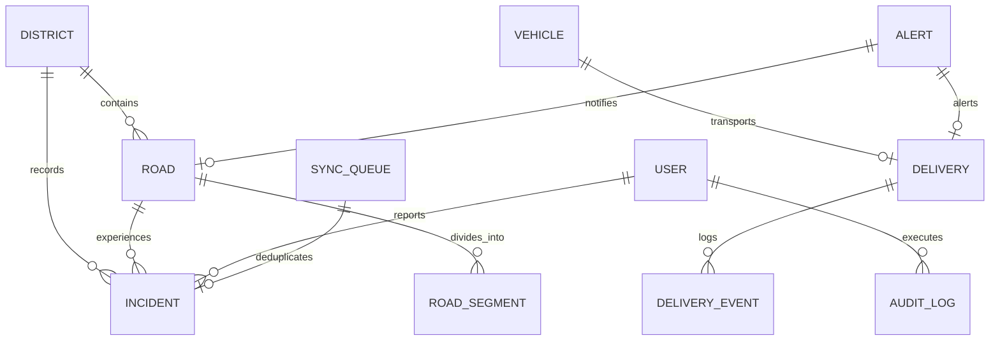

# NE-ROUTE Database Architecture & Data Models

NE-ROUTE utilizes an asynchronous relational database schema powered by SQLAlchemy 2.0 and supports both **SQLite with aiosqlite** (for rapid local deployment) and **PostgreSQL 16 + PostGIS** (for high-scale production spatial operations).

---

## 1. Schema Diagram & Entity Relationships

---

## 2. Entity Definitions

### `users`
Stores authenticated personnel accounts and Role-Based Access Control (RBAC) tiers:
- `id` (VARCHAR PK): Unique identifier (`usr-admin-01`).
- `email` (VARCHAR UNIQUE): Institutional email address.
- `hashed_password` (VARCHAR): Argon2/BCrypt cryptographic hash.
- `full_name` (VARCHAR): Name of the operator/officer.
- `role` (ENUM): `SUPER_ADMIN`, `COMMAND_DISPATCHER`, `FIELD_OFFICER`, `LOGISTICS_VIEWER`.
- `district_id` (VARCHAR FK -> districts.id, nullable).

### `districts`
Regional geographic administrative units across all 8 NER states:
- `id` (VARCHAR PK), `name` (VARCHAR), `state` (VARCHAR), `code` (VARCHAR).
- `vulnerability_index` (FLOAT 0.0 - 1.0): Multi-hazard vulnerability rating.
- `elevation_avg_m` (FLOAT): Mean topographical elevation.
- `terrain_type` (VARCHAR): Valley, Hillside, High Alpine, Floodplain.
- `boundary_geojson` (JSON): Spatial polygon geometry.

### `roads` & `road_segments`
Strategic transportation corridors and subdivided 10-25km operational sectors:
- `id` (VARCHAR PK), `code` (VARCHAR, e.g. `NH-6`, `NH-27`), `name` (VARCHAR).
- `state` (VARCHAR), `highway_type` (NATIONAL_HIGHWAY, STATE_HIGHWAY).
- `total_length_km` (FLOAT), `average_speed_kmh` (FLOAT).
- `accessibility_status` (ENUM: `ACCESSIBLE`, `RESTRICTED`, `BLOCKED`).
- `current_risk_score` (FLOAT 0.0 - 1.0).
- `geometry_geojson` (JSON): MultiLineString spatial path.

### `incidents`
Field hazard reports, blockage logs, and clearance tracking:
- `id` (VARCHAR PK), `incident_code` (VARCHAR, e.g. `INC-2026-001`).
- `type` (VARCHAR: `landslide`, `flood`, `rockfall`, `bridge_damage`, `subgrade_sinking`, `accident`).
- `severity` (ENUM: `LOW`, `MEDIUM`, `HIGH`, `CRITICAL`).
- `status` (ENUM: `REPORTED`, `VERIFIED`, `IN_CLEARANCE`, `RESOLVED`).
- `latitude` / `longitude` (FLOAT).
- `photos_json` (JSON Array): URLs of securely stored photographic evidence.
- `road_id` (FK -> roads.id), `district_id` (FK -> districts.id).

### `vehicles`
Tracked commercial, government, and emergency supply transports:
- `id` (VARCHAR PK), `registration_number` (VARCHAR, e.g. `AS-01-GC-4482`).
- `vehicle_type` (VARCHAR: `Heavy Truck (16T)`, `Refrigerated Medical`, `Tanker (Fuel)`).
- `current_status` (ENUM: `IDLE`, `MOVING`, `DELAYED`, `STOPPED`, `REROUTED`, `EMERGENCY`).
- `current_lat` / `current_lng` (FLOAT), `speed_kmh` (FLOAT), `heading_deg` (FLOAT).
- `fuel_percent` (FLOAT), `is_sos` (BOOLEAN).

### `deliveries` & `delivery_events`
Critical shipments and supply chain consignments:
- `id` (VARCHAR PK), `consignment_code` (VARCHAR, e.g. `NER-MED-2026-084`).
- `cargo_category` (VARCHAR: `Medical Supplies`, `FCI Food Grains`, `Petroleum`, `Relief`).
- `priority` (ENUM: `NORMAL`, `HIGH`, `CRITICAL`).
- `status` (ENUM: `PLANNED`, `IN_TRANSIT`, `DELAYED`, `AT_RISK`, `DELIVERED`).
- `origin_name` / `destination_name` (VARCHAR).
- `current_eta` (DATETIME), `delay_minutes` (INTEGER), `delay_reason` (VARCHAR).

### `alerts`
Structured 4-part actionable notifications:
- `id` (VARCHAR PK), `alert_code` (VARCHAR, e.g. `ALT-DEL-8924`).
- `alert_type` (ENUM: `ROAD_CLOSURE`, `DELIVERY_AT_RISK`, `PREDICTED_DISRUPTION`, `WEATHER_WARNING`).
- `severity` (ENUM: `LOW`, `MEDIUM`, `HIGH`, `CRITICAL`).
- `title` (VARCHAR), `what_happened` (TEXT), `why_it_matters` (TEXT), `who_is_affected` (TEXT), `recommended_action` (TEXT).
- `is_acknowledged` (BOOLEAN), `acknowledged_by` (VARCHAR).

### `sync_queue`
Idempotent outbox sync deduplication journal:
- `id` (VARCHAR PK), `client_id` (VARCHAR UNIQUE / idempotency key).
- `entity_type` (VARCHAR), `action` (VARCHAR), `sync_status` (ENUM: `PENDING`, `SYNCED`, `CONFLICT`).
- `payload_json` (JSON), `created_at` (DATETIME).

### `audit_logs`
Immutable compliance and operational decision audit log:
- `id` (VARCHAR PK), `user_id` (VARCHAR, nullable for system automated events).
- `action` (VARCHAR, e.g. `REROUTE_CONFIRMED`, `INCIDENT_VERIFIED`).
- `entity_type` (VARCHAR), `entity_id` (VARCHAR), `details_json` (JSON), `created_at` (DATETIME).
